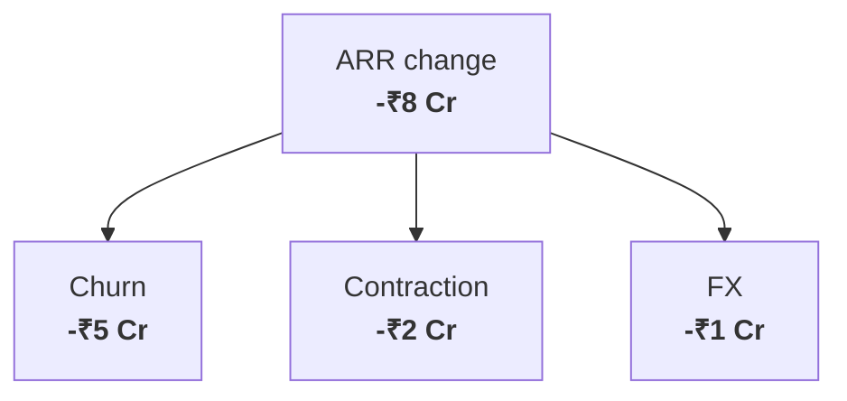
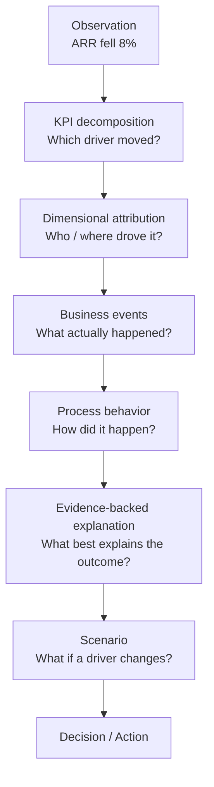
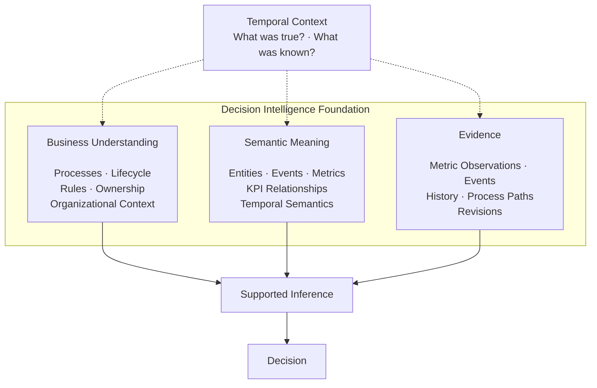
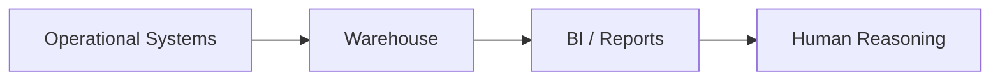
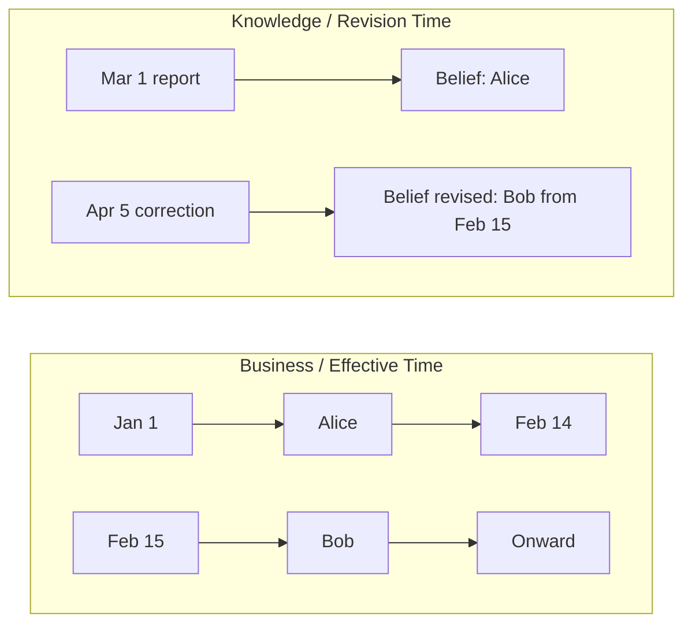
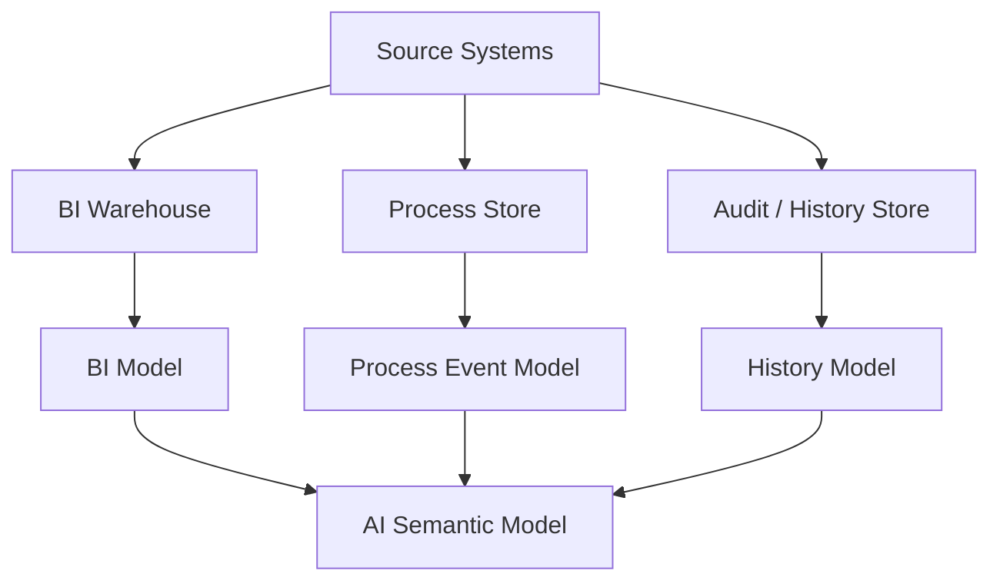

# 1. From Reporting to Decision Intelligence

For most of the history of data warehousing, the central problem was straightforward to describe even when it was difficult to implement:

> Bring data from many operational systems together, reconcile it, preserve history, and make the business easy to analyze.

That problem produced some of the most durable ideas in data architecture. Enterprise integration created consistent views across source systems. Dimensional modeling made analytical queries intuitive. Historized models preserved change. Semantic layers gave business measures stable definitions.

Those ideas still matter. The problem is not that traditional warehousing stopped working.

The problem is that **the job expected of the warehouse is expanding**.

A finance dashboard may ask:

> What was revenue last quarter?

A sales dashboard may ask:

> What is pipeline by region and stage?

A customer-success dashboard may ask:

> What was gross retention last month?

These are analytical questions. They are naturally expressed as measures sliced by dimensions and time.

Decision intelligence begins when the next questions arrive:

> Why did it change?

> What in the business produced that outcome?

> What should we do about it?

> What happens if we change one of the drivers?

Answering those questions reliably requires more than access to data. It requires **business understanding, semantic meaning, and evidence**, all interpreted in the correct temporal context.

---

## 1.1 A number is the beginning of the investigation

Imagine an executive sees the following number on Monday morning:

```text
ARR

Last month       ₹100 Cr
This month        ₹92 Cr
Change             -8%
```

The reporting system has already done something valuable. It has transformed operational complexity into a trusted business measurement.

But the measurement immediately creates another question:

> Why did ARR fall by 8%?

A KPI decomposition may show:



**Figure 1.1 — A metric movement decomposed into business drivers.**

The executive now knows *which drivers* mathematically explain the movement. But that is not yet a business explanation.

The next question is:

> Why did churn increase?

Suppose dimensional analysis shows:

```text
Churn ARR = -₹5 Cr

Enterprise Germany       -₹3.1 Cr
SMB Germany              -₹0.4 Cr
Other regions            -₹1.5 Cr
```

Now the questions become more operational:

> Which customers drove Enterprise Germany churn?

> What happened to those customers before they churned?

> Did they share a product, provider, account owner, implementation team, payroll problem, or process failure?

And finally:

> If the operational problem had been reduced by half, what would ARR have looked like?

The original dashboard question has become a reasoning path.



**Figure 1.2 — From metric observation to decision.**

This is not merely a more complicated SQL query. Each step requires a different kind of meaning to remain connected to the others.

---

## 1.2 Reporting asks for state; decision intelligence asks for understanding, meaning, and evidence

A conventional analytical question often asks for a state or aggregate:

```text
Revenue by region
Headcount by department
ARR by product
Customers by segment
Invoices outstanding
Payroll cost by country
```

Decision intelligence needs to go further. It needs three complementary foundations.

### Business understanding

Business understanding describes **how the enterprise actually works**:

- processes and lifecycle,
- organizational ownership,
- roles and responsibilities,
- business rules,
- commercial relationships,
- operational dependencies,
- and the meaning of transitions such as activation, churn, approval, correction, payment, or renewal.

Without business understanding, a system may calculate correctly while interpreting the organization incorrectly.

### Semantic meaning

Semantic meaning tells the system **how data should be interpreted**:

- what an entity represents,
- what an event means,
- how a metric is calculated,
- which dimensions are valid for a metric,
- how metrics aggregate through time,
- how KPI drivers relate mathematically,
- and which temporal interpretation applies.

Without semantic meaning, the system has records and columns but no reliable model for reasoning about them.

### Evidence

Evidence tells the system **whether a particular inference is supported by what actually occurred**:

- metric observations,
- event records,
- entity history,
- relationship history,
- process paths,
- source lineage,
- and revisions.

Without evidence, the system may possess a sophisticated business model and still produce an unsupported explanation.



**Figure 1.3 — Business understanding, semantic meaning, and evidence form the foundation for supported inference. Temporal context applies across all three.**

A useful distinction is:

> **Business understanding tells the system how the enterprise works. Semantic meaning tells it how the data should be interpreted. Evidence tells it whether a particular inference is supported. Temporal context ensures that all three are interpreted as they were true or known at the relevant point in time.**

This distinction becomes concrete in the ARR example.

**Business understanding** says that customers can start, expand, contract, and churn; that products belong to commercial arrangements; and that ownership, geography, and service relationships can influence outcomes.

**Semantic meaning** says that one useful ARR bridge is:

```text
Ending ARR
=
Starting ARR
+ New ARR
+ Expansion ARR
- Contraction ARR
- Churn ARR
```

**Evidence** says that in this particular period:

```text
ARR movement          -₹8 Cr
Churn contribution    -₹5 Cr
```

and allows the analysis to continue into the actual churn events, customers, participants, and process histories supporting that explanation.

The distinction is crucial for AI. A language model can make data easier to query, but **natural-language access to a reporting model is not automatically decision intelligence**. The quality of an inference remains bounded by the business context, semantics, and evidence preserved underneath it.

---

## 1.3 The lifecycle is evidence, not operational noise

Consider an invoice.

A reporting model may ultimately care about its final analytical state:

```text
Invoice INV-123
Amount      ₹95,000
Status      PAID
Paid Date   25 Mar
```

Operationally, however, the invoice may have experienced a lifecycle:


**Figure 1.4 — A transaction entity has a lifecycle composed of events.**

The final state is correct, but by itself it cannot answer:

- How many invoices required correction before issue?
- Are corrected invoices taking longer to get paid?
- Which teams, products, countries, or vendors are associated with repeated corrections?
- How much working-capital delay is associated with those process variants?

The lifecycle is therefore not incidental data around the analytical record. It is evidence about how the business produced the final state.

This also introduces a distinction that will become important later in the book:

> **An invoice is an entity. “Invoice corrected” is an event.**

The noun persists. The verbs describe its history.

---

## 1.4 The warehouse is becoming part of the reasoning system

Historically, the warehouse was often the place where data was prepared before reasoning happened elsewhere.



**Figure 1.5 — In a traditional analytical workflow, much of the semantic navigation happens in the analyst's head.**

The analyst knew which metric to decompose, which dashboard to open next, which operational table contained the relevant transactions, which owner had changed mid-quarter, and how a correction should be interpreted.

Conversational analytics and analytical agents move part of that reasoning into the system itself.


**Figure 1.6 — AI-era analytics increasingly expects the system to navigate from question to evidence-backed explanation.**

This does not mean the warehouse should become an AI model. It means the data foundation must preserve enough structure for reasoning systems to navigate business meaning without reconstructing it from disconnected artifacts every time.

---

## 1.5 A global payroll example

Global payroll makes this problem especially visible because it combines lifecycle, money, people, geography, ownership, corrections, deadlines, providers, and regulatory context.

Suppose a payroll run is processed on March 20:

```text
Payroll Run PR-2026-03-DE
Processed amount = €100,000
```

A validation step identifies an error. Payroll is corrected on March 22 and paid on March 25.


**Figure 1.7 — A correction before payment is a sequence of valid business events, not simply an overwritten value.**

A reporting question may ask:

> How much payroll was paid in Germany in March?

Answer: **€95,000**.

But other questions are equally valid:

> What amount was initially processed? — **€100,000**

> How much was corrected? — **-€5,000**

> How long elapsed between initial processing and correction? — **2 days**

> Did correction happen before payment? — **Yes**

Then the investigation can continue:

> Was this an isolated correction or part of a recurring process pattern?

> Is the pattern concentrated under a particular provider, country, client segment, payroll owner, or product configuration?

> Did correction frequency increase operating cost or reduce payroll margin?

The same underlying business history is serving reporting, audit, process mining, root-cause analysis, and financial decision-making.

A canonical model that keeps only the final paid amount is unnecessarily lossy for those workloads.

---

## 1.6 Time is more complicated than a date dimension

Decision intelligence exposes another problem: there is more than one kind of time.

Suppose an account appears to have been owned by Alice throughout February. On April 5, the source is corrected:

> Bob actually became the account owner effective February 15.

Two statements are simultaneously meaningful:

1. Bob was the effective owner on February 20.
2. On March 1, the warehouse still believed Alice was the owner.



**Figure 1.8 — Effective time describes when something was true; revision time describes when that truth was known or recorded.**

For current-state reporting, the distinction may sometimes be hidden. For audit, reconciliation, historical attribution, reproducibility, and AI explanation, it is essential.

The same issue appears in metrics.

Suppose February ARR was originally attributed as:

```text
Alice-owned accounts   ₹10 Cr
Bob-owned accounts      ₹5 Cr
```

After the backdated ownership correction, company ARR might still be ₹15 Cr, but the attribution changes.

The total did not change. The dimensional explanation did.

The architecture therefore needs to distinguish:

```text
VALUE RESTATEMENT
The measured value itself changed.

DIMENSIONAL RESTATEMENT
The value stayed the same, but its historical attribution changed.
```

---

## 1.7 Why simply adding more marts eventually becomes fragile

Traditional warehouse architectures can support all of these requirements. One can add transaction facts, periodic snapshots, accumulating snapshots, SCD2 dimensions, bridges, audit tables, event stores, process-mining extracts, semantic models, KPI metadata, scenario tables, lineage metadata, and application-specific history structures.

There is nothing inherently wrong with doing so.

The architectural question is whether these structures repeatedly reconstruct business meaning independently, or whether they are projections from a common semantic foundation.



**Figure 1.9 — When analytical, process, audit, and AI models evolve independently, identity, time, relationship, and metric semantics can drift.**

The Temporal Semantic Warehouse asks a different question:

> What canonical business constructs should be preserved so that these consumption models can be generated without repeatedly reconstructing meaning or discarding evidence needed by another workload?

The answer developed through this book is built progressively around:

```text
Entities
Events
Temporal Relationships
Metric History
KPI / Driver Semantics
```

Not every implementation needs every construct on day one. The important point is that they form a coherent semantic system rather than unrelated analytical add-ons.

---

## 1.8 Canonical truth and consumption models are different responsibilities

A star schema is an excellent interface for many BI workloads.

A canonical event projection is an excellent interface for process mining.

A KPI graph is an excellent interface for driver reasoning and simulation.

A governed semantic model is an excellent interface for conversational analytics.

These facts do not require the enterprise's canonical representation to be stored in one of those consumption shapes.

```mermaid
flowchart TB
    subgraph C["Canonical Business Model"]
        EN["Entities"]
        EV["Events"]
        TB["Temporal Relationships"]
        MH["Metric History"]
        KG["KPI / Driver Semantics"]
        EN --> TB
        EV --> TB
       