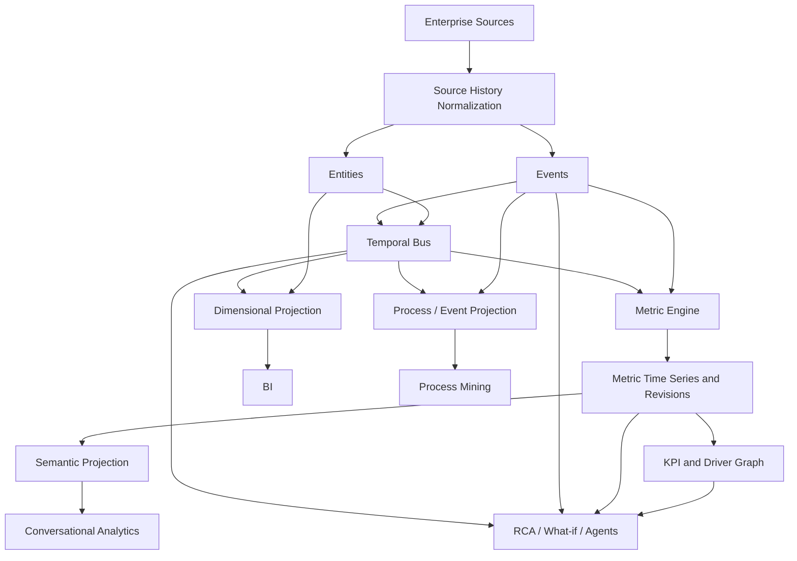

# Temporal Semantic Warehouse Framework Specification

**Version:** 0.1  
**Status:** Working Draft  
**Date:** 20 August 2026  
**License:** CC BY-SA 4.0  
**Specification type:** Engine-neutral semantic and temporal warehouse framework

---

## Abstract

The Temporal Semantic Warehouse (TSW) is an engine-neutral framework for representing enterprise business truth in a form that supports conventional BI and modern decision-intelligence workloads from the same governed foundation.

The framework defines six cooperating semantic constructs:

1. **Entities** — persistent business objects and their state;
2. **Events** — occurrences and transitions involving those objects;
3. **Temporal Bus** — historically valid relationships and participation among entities;
4. **Metric Time Series** — reusable measurements through business time, with revision history where required;
5. **KPI / Driver Graphs** — governed mathematical and business relationships among outcomes and drivers;
6. **Projections** — consumer-oriented representations such as dimensional facts, semantic models, process logs, graph views, and AI-facing structures.

The framework does not replace dimensional modeling, enterprise integration, or historized warehouse techniques. It defines a canonical semantic layer from which those structures can be generated or exposed according to workload.

The principal design objective is to preserve enough **business understanding, semantic meaning, temporal context, and evidence** that analytical systems and AI can move beyond reporting a number toward explaining how the business produced it, while remaining auditable about what was true and what was known at a given time.

---

## 1. Status and conventions

This document is a **Working Draft**, not an accredited industry standard and not a claim of external consensus.

The key words **MUST**, **MUST NOT**, **SHOULD**, **SHOULD NOT**, and **MAY** indicate normative requirements. Examples and implementation notes are informative unless explicitly marked normative.

A conforming implementation need not use any particular storage engine, table format, streaming system, semantic product, BI tool, or AI system.

---

## 2. Scope

TSW specifies:

- canonical semantics for entities, events, relationships, metrics, revisions, and KPI drivers;
- business-time and recorded-time behavior;
- lifecycle, deletion, correction, supersession, late-arrival, and restatement semantics;
- normalization of heterogeneous source histories including SCD1, SCD2, audit/Envers-style revisions, CDC, append-only events, and periodic snapshots;
- convergence of streaming, micro-batch, and batch ingestion into the same semantic state;
- rules for deriving metric time series from events and state;
- separation of persisted metric observations from query-time semantic measures;
- dimensional, semantic, process, and graph projections;
- support for multi-object and multi-hop process analysis;
- support for KPI trees, root-cause investigation, scenario analysis, conversational analytics, and agentic consumption;
- minimum conformance expectations.

TSW does **not** prescribe:

- a single physical schema;
- a single SQL dialect;
- a mandatory storage engine;
- a universal event table for every workload;
- a universal bus containing every relationship;
- a causal-inference algorithm;
- a particular LLM or agent architecture;
- or replacement of existing BI/semantic technologies.

---

## 3. Design principles

### 3.1 Canonical truth and consumption models are separate concerns

The canonical model MUST preserve business meaning required by multiple workloads. Consumer projections MAY simplify or denormalize that model.

A BI consumer MAY receive a conventional star schema. A process-mining consumer MAY receive an object-centric event projection. A semantic engine MAY receive metrics, dimensions, joins, and business metadata. An agent MAY traverse KPI, metric, entity, relationship, and event evidence.

### 3.2 Business semantics are independent of processing latency

Streaming, micro-batch, and batch MUST NOT define different business meanings for the same canonical object. They differ in latency and execution strategy, not semantic contract.

### 3.3 History must be epistemically honest

An implementation MUST distinguish authoritative source history from warehouse-inferred history. If an SCD1 source reveals only that a value was observed to change on a particular extraction, the implementation MUST NOT claim an authoritative earlier business-effective time without supporting evidence.

### 3.4 Evidence is not causality

Events, process paths, dimensional concentration, and KPI decomposition MAY support a root-cause hypothesis. They MUST NOT be represented as proof of causality unless an appropriate causal method or governed business rule establishes that claim.

### 3.5 Engine features are optimizations, not semantics

MERGE, change-data feeds, materialized views, streaming tables, temporal extensions, table-format snapshots, and engine-specific functions MAY optimize an implementation. Conformance MUST NOT depend on those features.

---

## 4. Conceptual architecture



---

## 5. Canonical ontology

A useful shorthand is:

```text
Entity   = noun / thing with identity
Event    = occurrence / transition
Bus      = relationship and participation context through time
Metric   = governed measurement through time
Revision = what was known or calculated when
KPI      = governed relationship between outcomes and drivers
```

### 5.1 Entity families

TSW recognizes four common entity families.

**Business entities** represent actors and organizational objects: customer, vendor, person, legal entity, department, team.

**Transaction entities** represent persistent business objects around which a process occurs: order, invoice, opportunity, contract, cart, subscription, payroll run, payment, support ticket.

**Resource / asset entities** represent things provisioned, owned, consumed, allocated, or operated: product, SKU, device, seat, warehouse, project, workspace, cost center.

**Reference entities** provide governed classifications and mappings: currency, country, tax code, status taxonomy, canonical mapping, calendar, FX reference.

Roles SHOULD be modeled carefully. A person is an entity; employee, manager, account owner, or approver may be a temporal role or relationship rather than a duplicate person entity.

### 5.2 Transaction entity is not event

An invoice is a transaction entity. `invoice_created`, `invoice_corrected`, `invoice_issued`, and `invoice_paid` are events in its lifecycle.

A conforming model SHOULD preserve this distinction where the business object persists across multiple occurrences.

---

## 6. Entity contract

An entity implementation MUST provide a stable business identity independent of individual source-system row identity.

A temporal entity version SHOULD support:

```text
entity_id
entity_type
source_identifiers
attributes
effective_from
effective_to
recorded_from
recorded_to
revision_id
lifecycle_state
provenance
```

Not every attribute requires SCD2 behavior. The entity definition MAY classify attributes by change semantics.

### 6.1 Entity lifecycle

An implementation MUST define semantics for at least:

```text
create
update
deactivate
reactivate
merge
split
delete-observed
business-termination
```

A source `DELETE` MUST NOT automatically be interpreted as business termination.

For example, deletion from a CRM may mean account closure, duplicate merge, archival, privacy deletion, migration, or erroneous cleanup. The adapter records the source operation; canonical lifecycle rules determine its business interpretation.

Physical deletion of historical canonical records SHOULD be avoided except where law, policy, or data-retention requirements require it.

---

## 7. Event contract

A canonical event represents an occurrence or transition at an identifiable business time.

A generic logical contract MAY contain:

```text
event_id
event_timestamp
event_family
event_type
primary_entity_id
primary_entity_type
measure_name
measure_value
measure_previous_value
currency
fx_from
fx_to
participants
additional_attributes
recorded_at
source_id
source_sequence
revision_metadata
```

Lifecycle events MAY use a unit measure such as `1`. Quantitative transitions MAY preserve previous and resulting values.

Example:

```text
ARR_CHANGED
previous = 10,000
value    = 12,000
movement = +2,000
```

### 7.1 Event identity and idempotency

Canonical event identity MUST be deterministic or otherwise stable enough to support duplicate detection and replay.

Processing the same source event repeatedly MUST NOT create multiple logically distinct canonical events unless the source itself represents multiple occurrences.

### 7.2 Business transition versus historical correction

The framework distinguishes:

**Business transition** — something genuinely changed later.

```text
20 Mar payroll_processed  100K
23 Mar payroll_corrected    95K
```

Both occurrences remain historically valid.

**Historical correction / restatement** — earlier recorded history was wrong or incomplete.

A restatement MUST preserve enough revision metadata to distinguish the corrected effective history from what was previously recorded when auditability is required.

### 7.3 Event supersession

An erroneous event SHOULD be superseded or revised rather than silently physically removed when downstream history has already consumed it.

A framework implementation SHOULD support:

```text
supersedes_event_id
correction_reason
correction_effective_at
recorded_at
revision_id
```

---

## 8. Participation and the Temporal Bus

The Temporal Bus generalizes the idea of conformed dimensional context into historically valid relationships and event participation.

A bus SHOULD be scoped to a coherent business family rather than implemented as one universal combination of every enterprise entity.

Examples:

```text
Revenue Bus:
customer ↔ contract ↔ product ↔ legal entity ↔ billing country

Subscription Bus:
customer ↔ subscription ↔ product ↔ account owner ↔ country

GTM Bus:
account ↔ opportunity ↔ sales rep ↔ team ↔ campaign
```

A temporal relationship SHOULD support:

```text
relationship_id / bus_id
participant keys
participant roles
effective_from
effective_to
recorded_from
recorded_to
revision_id
provenance
```

### 8.1 Event-object participation

`participants_json` MAY be used as a convenient physical event representation, but JSON MUST NOT be the semantic contract.

The framework SHOULD be able to project participation into a typed relation:

```text
event_id
entity_type
entity_id
participation_role
```

This enables object-centric and graph-oriented consumption without coupling semantics to JSON parsing.

### 8.2 Backdated relationship changes

If account ownership is corrected in April to be effective from February 15, the bus MUST be capable of representing the corrected effective relationship. If revision audit is enabled, it MUST also retain when the warehouse learned the correction.

Downstream metric impact MAY be a **dimensional restatement** even when the total metric value is unchanged.

---

## 9. Temporal contract

TSW distinguishes at least three temporal coordinates where relevant:

1. **effective/event time** — when something was true or occurred in the business;
2. **recorded/revision time** — when the platform recorded or believed it;
3. **arrival/processing time** — when data reached or was processed by the platform.

These MUST NOT be conflated when their difference affects meaning.

The common vocabulary is:

```text
effective_from / effective_to
recorded_from / recorded_to
revision_id
```

Events normally use occurrence time plus recorded metadata rather than an SCD2 interval.

Metric observations use metric period plus revision time.

---

## 10. Source-history normalization

Source adapters MUST declare what historical information a source actually provides.

Supported source modes SHOULD include:

```text
scd1
scd2
audit_revision
cdc
append_only_event
periodic_snapshot
```

### 10.1 SCD1/current-state sources

For SCD1 sources, the framework MAY infer change by comparing extracts. The observation time is authoritative as an observation; the true effective time is unknown unless another source field or event establishes it.

### 10.2 SCD2 sources

Source-provided effective intervals MAY map directly to canonical effective time after validation and conformance to source-specific semantics.

### 10.3 Audit / Envers-style sources

Revision history provides strong evidence of recorded-time change. A revision timestamp MUST NOT automatically be treated as business-effective time.

### 10.4 CDC sources

CDC insert/update/delete operations describe technical source mutations. The adapter MUST interpret them through entity/event lifecycle rules before assigning business semantics.

### 10.5 Periodic snapshots

Snapshot differencing MAY infer observed transitions. The framework SHOULD record the observation interval or uncertainty where exact change time is unavailable.

### 10.6 Append-only event sources

Source events MAY map directly to canonical events when identity, ordering, occurrence time, and event semantics are sufficiently governed.

---

## 11. Late arrival, ordering, and replay

The framework MUST support data arriving after its effective/event time.

A late event MAY cause:

- entity history revision;
- bus relationship revision;
- metric value restatement;
- dimensional restatement;
- process-path revision;
- semantic projection refresh.

Implementations SHOULD use watermarks or equivalent operational controls, but watermarks MUST NOT redefine historical business truth. A closed processing window MAY be reopened or restated according to policy.

Replay MUST be idempotent.

---

## 12. Batch, micro-batch, and streaming

The canonical semantics are execution-mode neutral.

```text
streaming CDC ───────┐
micro-batch API ─────┤
hourly files ────────┤
daily snapshots ─────┤──> normalization -> canonical changes
manual restatement ──┘
```

A streaming implementation MAY update open-period metrics continuously. A batch implementation MAY calculate the same metrics nightly. Given equivalent source history and restatement policy, both SHOULD converge to equivalent canonical business state.

Exactly-once delivery is not required as a transport guarantee if deterministic identity and idempotent processing produce exactly-once **logical effects**.

---

## 13. Metric Time Series

Metric Time Series (MTS) persist reusable business measurements across time and context.

A logical metric instance SHOULD include:

```text
metric_instance_id
metric_name
period_start
period_end / grain
bus_id or dimensional context
metric_value
unit / currency
revision_number
recorded_at
revision_reason
source_watermark / provenance
```

### 13.1 Why metric time series exist

MTS provide efficient state-through-time without requiring every query to replay raw events and without creating a bespoke snapshot fact for every state metric.

Examples include:

```text
ARR by day
headcount by month
open ticket backlog by day
inventory on hand by day
pipeline by week
payroll payable by cycle
```

The current open period MAY be recalculated as data arrives. Closed periods SHOULD remain stable except when a correction, late arrival, policy change, or authorized restatement requires revision.

### 13.2 Metric behavior types

Metric definitions SHOULD declare temporal behavior.

**State** — ARR, headcount, inventory, active seats. Higher-grain rollup commonly uses last valid state.

**Flow** — revenue, bookings, payments, units shipped. Higher-grain rollup commonly sums lower-grain flows.

**Count** — hires, churns, activations, corrections. Usually additive when event semantics allow.

**Ratio / derived** — conversion rate, churn rate, ARPU, NRR. SHOULD normally be recomputed from governed components rather than averaged from precomputed ratios.

### 13.3 Metric revisions

When a historical metric changes, the implementation SHOULD append a new revision rather than silently overwrite the only historical record if audit/reproducibility is required.

```text
M100 payroll Mar rev1 100K recorded Mar20
M100 payroll Mar rev2  95K recorded Mar23
```

The metric instance is stable; the revision is immutable.

---

## 14. Semantic layer versus Metric Time Series

This boundary is normative because conflating the two produces duplication and unclear ownership.

### 14.1 Metric Time Series responsibility

MTS SHOULD persist primitive, stateful, expensive-to-reconstruct, historically restatable, or operationally reusable observations.

Examples:

```text
ARR
new ARR
expansion ARR
contraction ARR
churn ARR
revenue
bookings
active customers
churned customers
open backlog
inventory on hand
```

MTS owns **observation through time and revision history**.

### 14.2 Semantic layer responsibility

A semantic