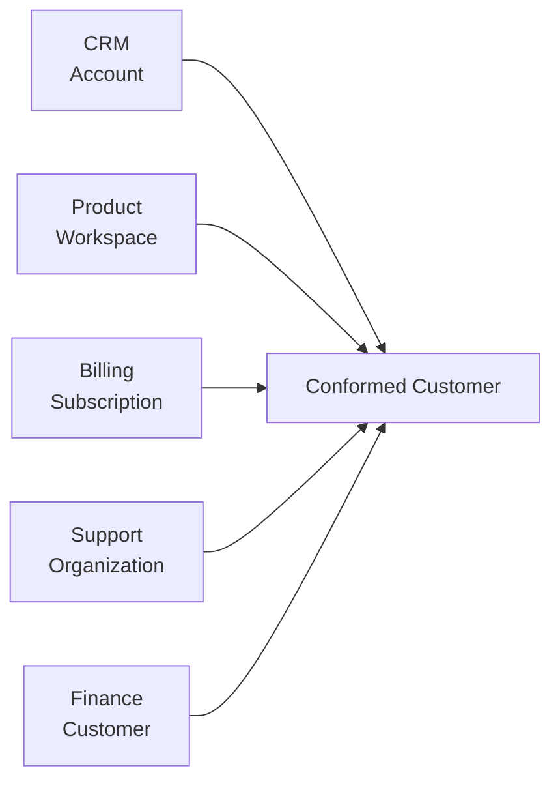
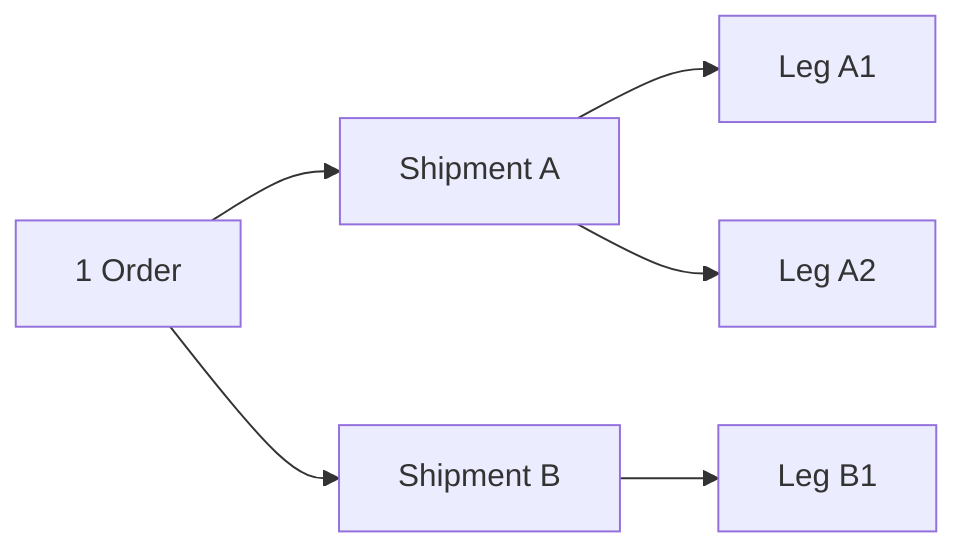
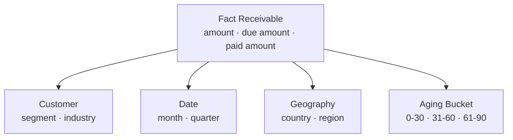
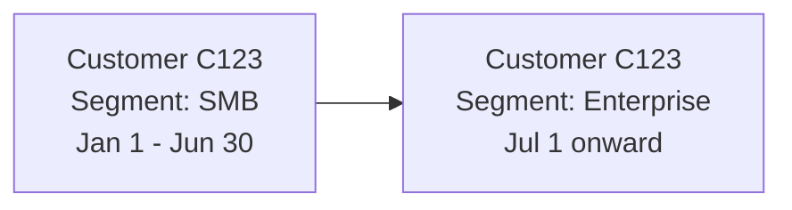
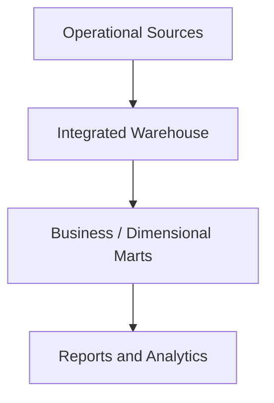
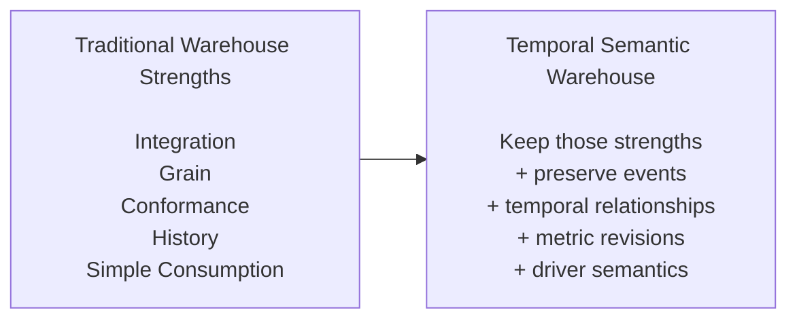

# 2. What Traditional Warehouses Get Right

Chapter 1 argued that the analytical platform is being asked to do more than report trusted numbers. Before adding new machinery, however, it is worth asking a simpler question:

> What problems have traditional warehouse architectures already solved well?

This matters because a useful new framework should not rediscover old lessons with new terminology. The Temporal Semantic Warehouse should preserve the strengths of established warehouse design while extending the information available for decision intelligence.

The strongest ideas are remarkably durable: integrate data before asking the business to reconcile it repeatedly, declare the grain of a measurement, separate descriptive context from measurements, preserve history deliberately, conform meaning across domains, and present consumers with models they can understand.

---

## 2.1 Integration is still the first job

Imagine a SaaS company with customer information spread across five systems:

- CRM knows the sales account and opportunity,
- product knows the workspace and users,
- billing knows the subscription and invoice,
- support knows tickets and contacts,
- finance knows revenue and collections.

Each system may have a different identifier and a slightly different idea of the customer.



**Figure 2.1 — The warehouse creates shared identity across operational systems.**

Without this integration, every dashboard or analyst has to solve entity matching again. One report groups by CRM account, another by billing customer, and a third by product workspace. The organization appears to have several different realities because the analytical layer never reconciled identity.

Whether the implementation follows Inmon, Kimball, Data Vault, or the framework developed in this book, **conformed identity remains foundational**.

---

## 2.2 Grain is one of the most important ideas in analytics

Consider a logistics business.

A table might contain:

```text
shipment_id
order_id
warehouse
carrier
cost
weight
status
```

Before anyone sums `cost`, one question must be answered:

> What does one row represent?

Is it one order? One shipment? One package? One shipment leg? One status change?

If an order produces three shipments and each shipment has two legs, joining tables without respecting grain can multiply values silently.



**Figure 2.2 — Business objects naturally exist at different grains.**

Dimensional modeling made grain an explicit design discipline. That lesson carries directly into the Temporal Semantic Warehouse.

An event has a grain: **one occurrence**.

An entity version has a grain: **one version of one business object**.

A bus version has a grain: **one historically valid relationship context**.

A metric observation has a grain such as:

```text
metric × period × dimensional context × revision
```

The terminology changes, but the discipline does not.

---

## 2.3 Facts and dimensions make business analysis understandable

Suppose a collections leader asks:

> How much overdue receivable do we have by customer segment, region, and aging bucket?

A dimensional model is almost ideal for this question.



**Figure 2.3 — A star schema is intentionally optimized for a class of analytical questions.**

The model is easy to explain:

- facts contain measurements,
- dimensions provide descriptive context,
- dimensions filter and group facts.

That simplicity is valuable. The Temporal Semantic Warehouse should not force a collections analyst to traverse an event graph to answer a straightforward aging question.

Later chapters will therefore treat star schemas as **excellent consumption projections**.

The distinction is not "star schema versus semantic warehouse." It is:

> **What should be canonical, and what should be projected for a particular workload?**

---

## 2.4 Conformed dimensions solved an organizational problem, not merely a database problem

Suppose Sales defines Enterprise as customers with more than 1,000 employees, while Support uses annual contract value and Finance uses a manually maintained strategic-account list.

All three dashboards may be technically correct according to their own logic, yet executives cannot reconcile them.

Conformed dimensions address this by establishing shared definitions.

```text
Customer Segment

Enterprise
Mid-Market
SMB
```

The important idea is not the physical dimension table. It is the **enterprise contract around meaning**.

The same principle applies later to:

- canonical entities,
- event taxonomy,
- metric definitions,
- KPI relationships,
- lifecycle states,
- and temporal semantics.

Decision intelligence makes conformance more important, not less. An AI system that can query every table but encounters five definitions of "active customer" does not possess enterprise understanding. It possesses faster access to disagreement.

---

## 2.5 Slowly changing dimensions taught warehouses to respect history

Consider a customer that moves from SMB to Enterprise on July 1.

If the customer table simply overwrites:

```text
segment = SMB
```

with:

```text
segment = Enterprise
```

then a report rerun for March may suddenly classify the customer's March revenue as Enterprise revenue.

SCD2 solves this by preserving versions:

```text
Customer C123

SMB         Jan 01 → Jun 30
Enterprise  Jul 01 → current
```



**Figure 2.4 — SCD2 preserves changing descriptive state.**

This is a major conceptual ancestor of the Temporal Semantic Warehouse.

The new framework extends the question rather than rejecting the solution:

- What if the July 1 change is entered only on July 10?
- What if the source later says it was actually effective June 15?
- What if the relationship that changed was not a customer attribute but the account owner?
- What if a metric calculated before the correction must remain auditable?

SCD2 gives us the first clock. Later chapters introduce why decision intelligence sometimes needs another.

---

## 2.6 Snapshot facts solve a real analytical need

Suppose a support organization wants to know open-ticket backlog at the end of every day.

Ticket events might be:

```text
09:00 opened
11:15 assigned
15:40 escalated
next day 10:10 resolved
```

But an operations dashboard wants:

```text
Date        Open backlog
Aug 17      1,204
Aug 18      1,261
Aug 19      1,198
```

A periodic snapshot fact makes that query simple and fast.

Similarly:

- SaaS uses daily ARR snapshots,
- HR uses headcount snapshots,
- supply chain uses inventory snapshots,
- sales uses pipeline snapshots,
- finance uses balance snapshots.

The Temporal Semantic Warehouse will later ask whether many such snapshots can be represented more uniformly as **metric time series**. But the business requirement does not disappear: analysts need state through time without replaying every underlying event for every query.

This is an important design principle:

> A new abstraction is useful only if it preserves the convenience that the older structure provided.

---

## 2.7 Transaction and accumulating facts capture different kinds of truth

Consider order fulfillment.

A transaction fact may record each shipment:

```text
shipment_id
shipped_at
quantity
shipping_cost
```

An accumulating snapshot may instead represent the progress of an order:

```text
order_created_at
approved_at
picked_at
shipped_at
delivered_at
```

The first answers questions about occurrences. The second makes lifecycle duration easy to analyze.


**Figure 2.5 — Accumulating snapshots flatten a lifecycle into milestones for convenient analysis.**

This is useful. But it also reveals a trade-off that will matter later.

If the process becomes:

```text
Created → Approved → Picked → Failed QA → Repacked → Picked → Shipped
```

fixed milestone columns no longer describe the full execution path naturally.

The traditional structure remains excellent for the question it was designed to answer. The event model preserves a richer history for questions that were not known in advance.

---

## 2.8 Mature warehouse design separates integration from consumption

A common misconception is that traditional warehousing means "put everything in a star schema." In practice, mature architectures have long separated layers.

A simplified pattern is:



**Figure 2.6 — Integration and consumption have long been separate concerns in mature warehouse architectures.**

Inmon emphasizes an integrated enterprise warehouse before downstream marts. Kimball emphasizes dimensional structures and conformed dimensions. Data Vault separates raw historical integration from business interpretation and information delivery.

The Temporal Semantic Warehouse continues this lineage. Its argument is not that separation is new. Its argument is that the **canonical layer should preserve additional semantic and temporal structures useful to modern reasoning workloads**.

---

## 2.9 Why these strengths become even more important with AI

It is tempting to assume that language models reduce the need for careful warehouse modeling because they can interpret schemas dynamically.

The opposite is often true.

A human analyst can notice that two tables use different definitions of `customer_status`. An automated reasoning system may confidently combine them unless the semantic difference is explicit.

A human can know from organizational experience that "bookings" in Sales excludes renewals while Finance's bookings report includes them. An AI system needs that distinction represented somewhere reliable.

A human can realize that a support ticket was reassigned because the customer moved to a different service tier. An automated RCA system needs the historical relationship and lifecycle context to make that connection.

AI therefore increases the value of several traditional warehouse disciplines:

- conformed identity,
- declared grain,
- governed definitions,
- historical correctness,
- lineage,
- reproducibility,
- and understandable consumption models.

The objective is not to replace these disciplines with AI. It is to make them **machine-navigable**.

---

## 2.10 What we carry forward

The framework developed in this book inherits several principles directly from established warehouse practice.

| Traditional principle | What the Temporal Semantic Warehouse keeps |
|---|---|
| Enterprise integration | Canonical entity identity across sources |
| Declared grain | Explicit grain for entities, events, relationships, and metrics |
| Conformed dimensions | Shared semantic contracts across domains |
| SCD history | Temporal entity state and later bitemporal extension |
| Transaction facts | Atomic business occurrences represented as events or typed facts |
| Periodic snapshots | Efficient state-through-time represented through metric time series where appropriate |
| Accumulating snapshots | Convenient lifecycle projections generated from richer event histories |
| Data marts | Consumer-specific dimensional and semantic projections |
| Governance | Central definitions, lineage, and auditable transformations |

The important shift is therefore evolutionary rather than revolutionary.



**Figure 2.7 — The proposed framework extends established warehouse disciplines rather than discarding them.**

---

## 2.11 The next question

If traditional warehouse models already provide integration, history, facts, dimensions, snapshots, and business-friendly marts, why add anything else?

Because some modern questions require information that those structures do not always preserve as first-class, connected concepts.

For example:

> Which sequence of operational events preceded customer churn?

> Which objects participated across an order, shipment, invoice, dispute, and payment process?

> Which relationship was valid when an event occurred, and what did we believe that relationship was when last month's report was published?

> Which KPI driver explains a movement, and what evidence supports that inference?

> What changes if a driver is simulated rather than observed?

Chapter 3 turns those questions into explicit requirements. Only after those requirements are clear will we introduce the additional canonical constructs needed to answer them.
