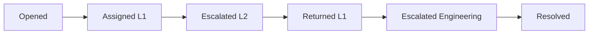
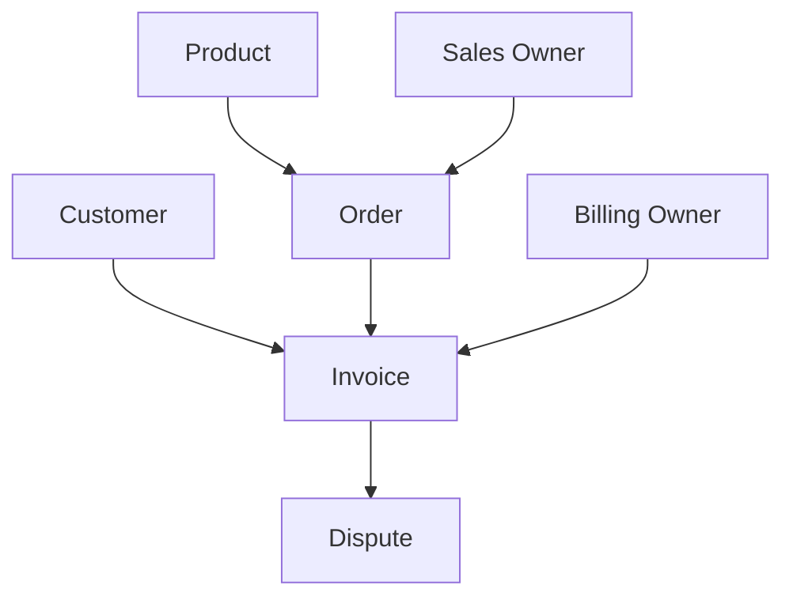
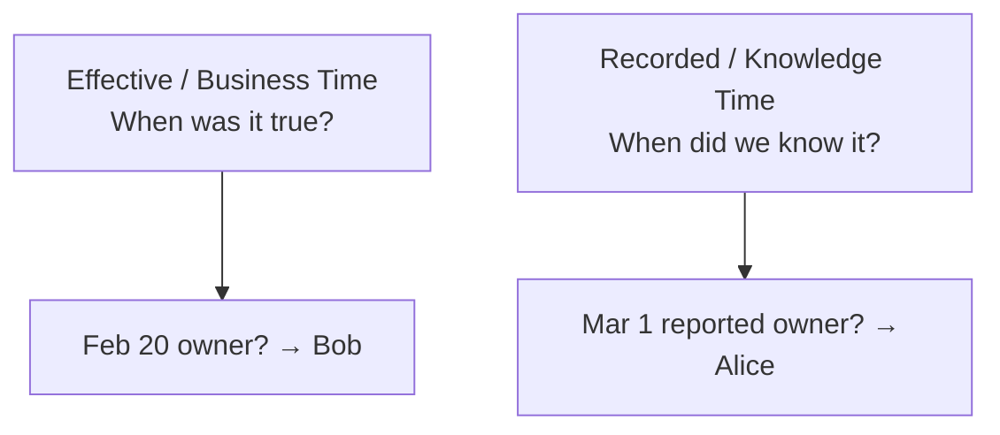
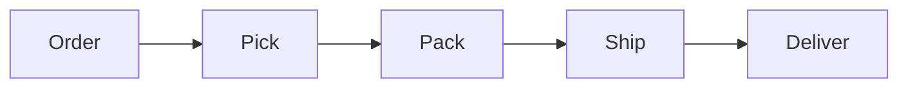
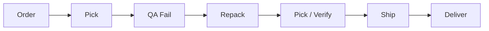
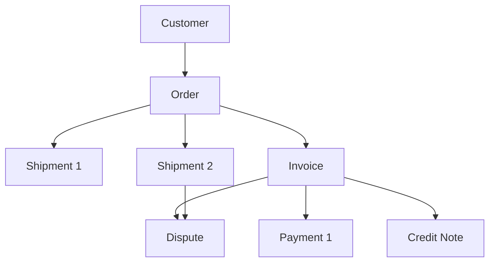
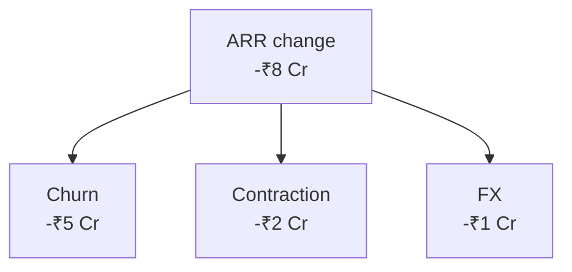
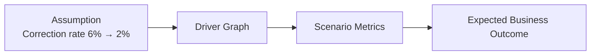
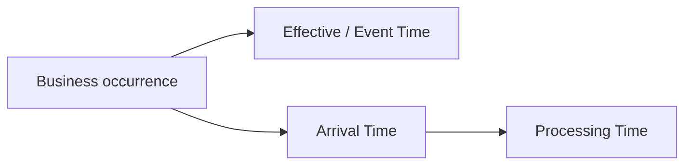
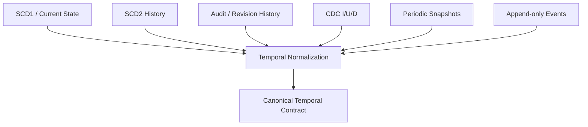

# 3. The Missing Questions: What, Who, Where, When, Why, and What If

Chapter 2 deliberately defended traditional warehousing. Integration, grain, conformed dimensions, historical state, facts, snapshots, and simple consumption models remain essential.

So where does the pressure for a richer canonical model actually come from?

Not from a new database technology. Not from AI by itself. It comes from the **questions the business now expects the analytical system to help answer**.

A dashboard commonly answers:

> What is the number?

Decision intelligence continues:

> What changed? Who and what were involved? What relationships were true at that time? How did the process unfold? Why is this a plausible explanation? What evidence supports it? What happens if we intervene?

This chapter turns those questions into requirements before introducing the model that will address them.

---

## 3.1 What happened?

Consider customer support.

A ticket currently shows:

```text
Ticket: T-4921
Status: Resolved
Priority: High
Resolution time: 31 hours
```

That state is useful. But suppose the support leader asks why high-priority resolution time increased.

The ticket's history may be:



**Figure 3.1 — The current state does not reveal the path that produced it.**

The sequence reveals handoffs and rework. If hundreds of slow tickets share the same loop, that is operational evidence unavailable from the final status alone.

The first requirement is therefore:

> **Preserve important business occurrences as first-class events, not only as the final state they produced.**

---

## 3.2 Who and what participated?

Now consider an invoice dispute in a B2B company.

The dispute is not isolated. It may involve:

- a customer,
- an invoice,
- an order,
- one or more products,
- a salesperson,
- a billing owner,
- a legal entity,
- and perhaps a shipment or service-delivery record.



**Figure 3.2 — A business occurrence often has multiple participating objects.**

A row containing only `invoice_id` tells us the primary object but not necessarily the full business context.

This becomes more important in supply chain and logistics. A delayed delivery may involve an order, shipment, package, warehouse, route, carrier, supplier, customer, and SKU.

The second requirement is:

> **Preserve participation among business objects so an investigation can move across them without forcing one object to be the universal case.**

This requirement will later become central to multi-object process mining.

---

## 3.3 Where did it happen?

"Where" is broader than geography.

For a payroll correction, where may mean:

```text
Country       Germany
Legal entity  DE GmbH
Provider      Provider A
Payroll team  Central Europe
Client        Customer X
Product       Global Payroll
```

For a support escalation:

```text
Region        EMEA
Queue         Enterprise Payroll
Team          Tier 2
Product       Payroll
Channel       Email
```

For logistics:

```text
Warehouse     Chennai DC-2
Route         South Corridor
Carrier       Carrier B
Destination   Bengaluru
```

The analytical context often comes from relationships between entities rather than from columns intrinsic to the event itself.

The third requirement is therefore:

> **Preserve the business context surrounding an occurrence, including relationships that may themselves change over time.**

---

## 3.4 When did it happen — and when did we know?

A sales account is assigned to Alice on January 1. On April 5, the CRM is corrected to show that Bob actually took ownership effective February 15.

Now ask:

> Who owned the account on February 20?

Answer: Bob.

Then ask:

> Who did the March 1 sales report believe owned it?

Answer: Alice.

Both answers are correct because they use different clocks.



**Figure 3.3 — Historical truth and historical knowledge are different questions.**

This matters for:

- audit,
- backdated ownership,
- payroll corrections,
- contract amendments,
- late-arriving events,
- metric restatements,
- and reproducibility of earlier reports.

The fourth requirement is:

> **Represent business time separately from the time at which information was observed, recorded, or revised.**

Not every source provides both clocks. Later chapters will discuss how the framework remains explicit about what is known versus inferred.

---

## 3.5 How much changed?

Events are not only lifecycle labels. Many business events contain quantitative movement.

A SaaS subscription may change:

```text
ARR before   ₹10,000
ARR after    ₹12,500
Delta         ₹2,500
```

Inventory may change:

```text
On hand before   400
Received         120
On hand after    520
```

A collections event may record:

```text
Outstanding before   ₹500,000
Payment received     ₹200,000
Outstanding after    ₹300,000
```

A useful event representation can retain both previous and resulting values when appropriate.

That gives the system two views:

```text
STATE     What is the value now?
MOVEMENT  What changed at this occurrence?
```

The fifth requirement is:

> **Preserve quantitative movement in a way that supports both state reconstruction and metric derivation.**

---

## 3.6 How did it happen?

Suppose a supply-chain dashboard reports that order-to-delivery time increased from 3.8 days to 5.1 days.

A dimensional breakdown may show that the increase is concentrated in one region and carrier.

But the operational question is:

> Where in the process did time increase?

Normal path:



Problematic path:



**Figure 3.4 — Process behavior explains how an outcome was produced.**

The final delivery record does not contain this path naturally. The path emerges from ordered events.

The sixth requirement is:

> **Preserve event sequences well enough to reconstruct actual process behavior, including loops, rework, waiting time, and deviations.**

---

## 3.7 Real processes cross multiple objects

Traditional process analysis is simplest when there is one obvious case identifier.

For example:

```text
Case = Support Ticket
```

But consider order-to-cash:



**Figure 3.5 — Real processes often span several object types and one-to-many relationships.**

Which is the case?

- the order?
- the shipment?
- the invoice?
- the customer?

Choosing one can flatten or duplicate another part of the process.

Now imagine the collections leader asks:

> Why did DSO increase?

The investigation may traverse:

```text
late payment
→ invoice dispute
→ related order
→ related shipment
→ delivery exception
→ warehouse / carrier
```

That is a **multi-hop process investigation**.

The seventh requirement is:

> **Allow process reasoning to traverse events and participating objects across multiple hops rather than requiring every process to be flattened around one predetermined case ID.**

---

## 3.8 Why did the KPI move?

Suppose ARR falls by ₹8 Cr.

A KPI model may decompose the movement:



**Figure 3.6 — KPI decomposition provides a mathematical explanation of a metric movement.**

This is one meaning of "why": the mathematical driver.

But the investigation may continue:

```text
Churn
→ Enterprise Germany
→ 12 customers
→ 8 experienced repeated payroll corrections
→ 6 shared Provider A
```

Now several types of explanation are involved:

```text
MATHEMATICAL
Which KPI driver contributed?

DIMENSIONAL
Which cohort, region, product, owner, provider?

OPERATIONAL
Which events occurred?

PROCESS
Which execution path was common?
```

The eighth requirement is:

> **Connect metric movement to driver semantics, business context, events, and process evidence without treating correlation as automatically causal.**

The qualification is important. A shared provider may be a strong investigative lead; it is not automatically proof that the provider caused churn.

Decision intelligence should support **evidence-backed inference**, not manufacture certainty.

---

## 3.9 What happens if we change something?

Once a driver graph exists, the business naturally asks counterfactual questions.

A collections leader may ask:

> What happens to cash collection if dispute rate falls from 8% to 5%?

A SaaS leader may ask:

> What happens to ending ARR if churn improves by 15%?

A logistics leader may ask:

> What happens to delivery SLA if QA rework is reduced by half?

A payroll operations leader may ask:

> What happens to payroll margin if correction rate falls from 6% to 2%?

These are not historical observations. They are scenarios.



**Figure 3.7 — What-if analysis propagates explicit assumptions through known driver relationships.**

The system must not mix simulated values with actual observations.

The ninth requirement is:

> **Represent scenarios as explicit alternatives to actuals, using governed driver relationships and preserving the assumptions behind the result.**

---

## 3.10 What changed in our understanding?

Suppose March payroll was initially calculated as €100,000 and later corrected to €95,000 before payment.

Two different histories exist.

Business events:

```text
Mar 20  processed   €100,000
Mar 22  corrected    €95,000
Mar 25  paid         €95,000
```

Analytical knowledge:

```text
As of Mar 20, payroll payable was believed to be €100,000.
As of Mar 22, payroll payable was recalculated as €95,000.
```

If the warehouse simply overwrites the metric, it can answer the current value but cannot reproduce the earlier analytical state.

The tenth requirement is:

> **Preserve revisions to derived measurements and historical interpretations when auditability or reproducibility requires them.**

---

## 3.11 Data does not arrive in business order

A logistics event may occur at 10:02 but arrive at the warehouse at 10:15 because a device was offline.

A payroll correction effective March 20 may arrive on April 3.

A customer segment change may be visible only when a nightly SCD1 snapshot is compared with the previous day's extract.

A CDC stream may deliver inserts, updates, and deletes continuously while another source sends a monthly file.

The business model cannot assume that arrival order equals business order.



**Figure 3.8 — Occurrence, arrival, and processing time can differ.**

The eleventh requirement is:

> **Keep business semantics independent of ingestion latency so batch, micro-batch, and streaming can converge on the same historical truth.**

---

## 3.12 Sources have different history capabilities

One CRM may expose only current state. Another may expose SCD2-style history. An application may have an audit/Envers table. A database may provide CDC. A warehouse may receive daily snapshots. A product platform may emit immutable events.

These sources do not provide equivalent information.



**Figure 3.9 — Different source-history behaviors must be normalized without pretending they provide the same guarantees.**

If an SCD1 source changes today, the warehouse may know only when it *observed* the change. It should not invent an authoritative effective date.

The twelfth requirement is therefore:

> **Normalize heterogeneous source-history mechanisms while preserving what is authoritative, what is inferred, and what is unknown.**

---

## 3.13 A requirements map for the rest of the book

We can now summarize the problem without yet prescribing the implementation.

| Business question | Information the canonical model must preserve |
|---|---|
| What happened? | Events and occurrence semantics |
| Who/what participated? | Stable entity identity and participation |
| Where/context? | Relationships and dimensional context |
| When was it true? | Effective/event time |
| When did we know? | Recorded/revision time |
| How much changed? | Measures, previous values, metric state |
| How did it happen? | Ordered event histories |
| How do objects connect? | Multi-object relationships |
| Why did the KPI move? | KPI/driver semantics + evidence |
| What if? | Explicit scenario semantics |
| What was revised? | Revision history |
| What arrived late? | Arrival/processing metadata and replay |
| What does the source actually know? | Source-history capability and provenance |

These requirements lead toward a canonical vocabulary that will eventually include entities, events, temporal relationships, metric histories, revisions, and KPI semantics.

But before introducing that model, we should understand the three major warehouse traditions it inherits from.

The next chapters therefore examine **Inmon, Kimball, and Data Vault** on their own terms: what problem each model was designed to solve, where it is strongest, and which ideas the Temporal Semantic Warehouse should carry forward.
